# Smart Greenhouse Environment Control System

• Jiadong Song; Jiayong Hu; Jingwei Li; Yiqi Zhou

<iframe src="https://player.vimeo.com/video/367126470" width="600" height="300" frameborder="0" allow="autoplay; fullscreen" allowfullscreen></iframe>

<a href="https://vimeo.com/367126470">12740Final_Environmental_Control</a> from <a href="https://vimeo.com/user90437655">jingwei</a> on <a href="https://vimeo.com">Vimeo</a>.

## 0. Progress Reports

##### [Progress Report4](progress_report_4_0.md)
##### [Progress Report3](progress_report_3_0.md)
##### [Progress Report2](progress_report_2.md)
##### [Progress Report1](progress_report_1.md)
##### [Progress Report0](progress_report.html)

## 1. Introduction

Our project is to use temperature and light intensity sensors to monitor and control the environmental factors in a greenhouse to make sure that they are in an appropriate range so the plants can grow fast with little human work.

### 1.1 Motivation

A greenhouse is a structure in which plants requiring regulated climatic conditions are grown. Many commercial greenhouses are high tech production facilities for plants. The greenhouses are filled with equipment including screening installation, heating, cooling, lighting, and may be controlled by a computer to optimize conditions for plant growth. Different techniques are then used to evaluate optimality-degrees and comfort ratio of greenhouse micro-climate (i.e., air temperature, relative humidity and vapor pressure deficit) in order to reduce production risk prior to cultivation of a specific crop.

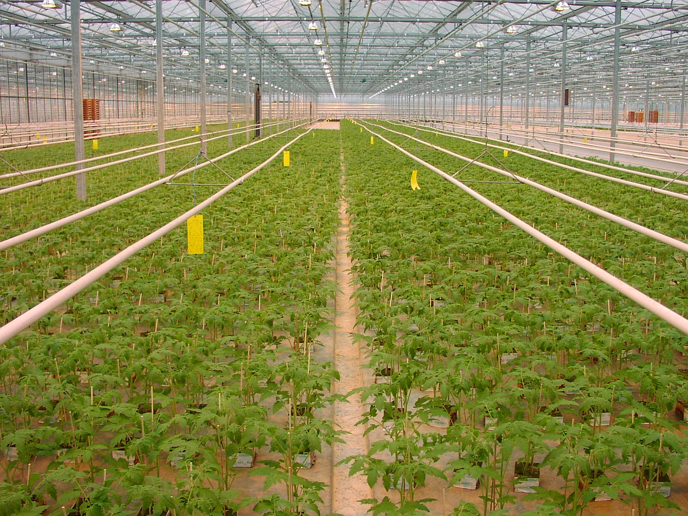

The greenhouse is one of the most important innovations to improve crop yield. Temperature and light intensity are two important environmental factors that affect the plants’ growth, which are also the factors we measure and control in this project. 

It is hard and time-consuming for people to monitor and control these factors manually. A lot of companies provide modern solutions for control system in greenhouse involving advanced equipment and machine learning methods. Our motivation behind this Smart Greenhouse project is to provide a simple and cheap solution for the greenhouse control system.

### 1.2 Goals

The goal of our system is to monitor the greenhouse environment and adjust the light and temperature automatically so that the plant is constantly absorbing light and in a convenient temperature range. Thus the crop yield can be maximized by ensuring the plant is always in a conducive growing environment while lowering the human effort required.

## 2. Methodology

### 2.1 Phenomena of Interest

The growth of the plant is mainly dependent on the temperature and light.

Light intensity is measured through illuminance, where lux are the units (equivalent to lumens per squared-meter). For reference, an office will normally have lux values between 320-500 lux.

Temperature is measured in unit of Celsius, where 0°C is the freezing point of water and 100°C is the boiling point of water.

### 2.2 Sensor(s) Used

We use DHT11 Temperature & Humidity Sensor Module and Photosensitive Light Sensor Module.

#### Temperature & Humidity Sensor Module

DHT11 Temperature-Humidity Sensor Module is an accurate and inexpensive sensor that includes an ADC to convert analog values of humidity and temperature. It comes with an 8-bit microcontroller and provides reliable output results.

Parameters:
* Power supply: 3.3 - 5 V
* Current: 2.5 mA max use of current during conversion (when data request)
* Humidity: 20 - 90 % ± 5 %
* Temperature: 0 - 50º ± 2 %
* Sampling rate: ≤ 1 Hz
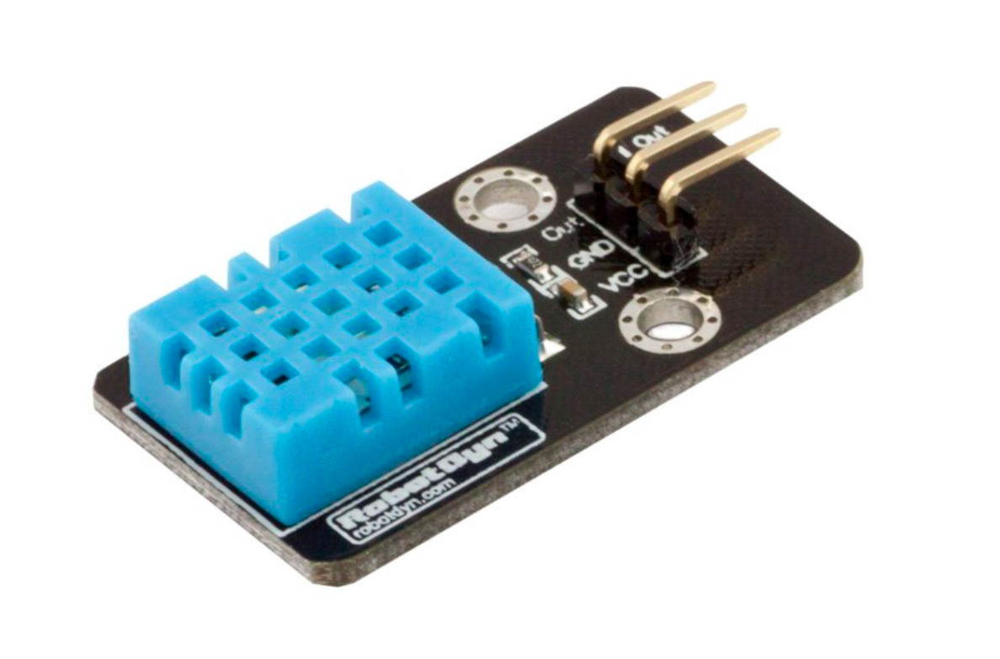

#### Photosensitive Light Sensor Module

The Light sensor module is based on photodetector GL5528 to detect the light intensity of the environment. As the resistance of the sensor varies depending on the amount of light it is exposed to, the output voltage changes with the light intensity. This module outputs both analog and digital signals, which can be used to trigger other modules. Also, the potentiometer can be used to adjust the sensitivity of the digital output. The digital terminal output HIGH when the light intensity exceeds the value set by a potentiometer and vice versa. The outputs of analog terminal increase with the light intensity.

Parameters:
* Working Voltage: 5V
* Output Signal: Analog or Digital(0 or 1)
* PCB Size: 3.2*1.4cm
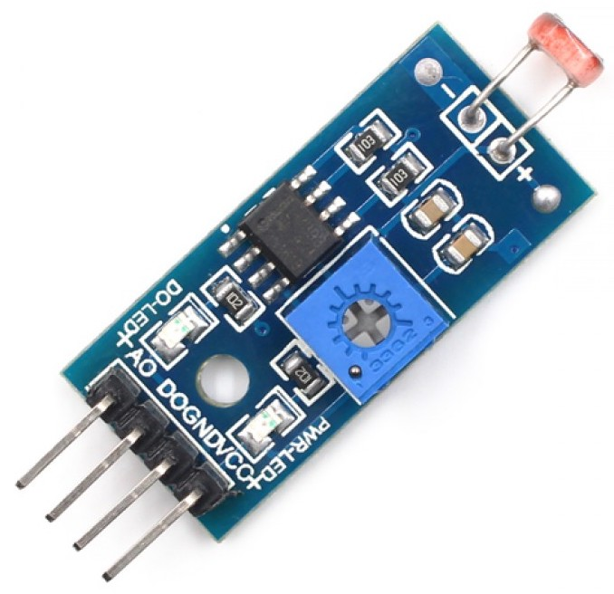

## 2.3 Signal Conditioning and Processing

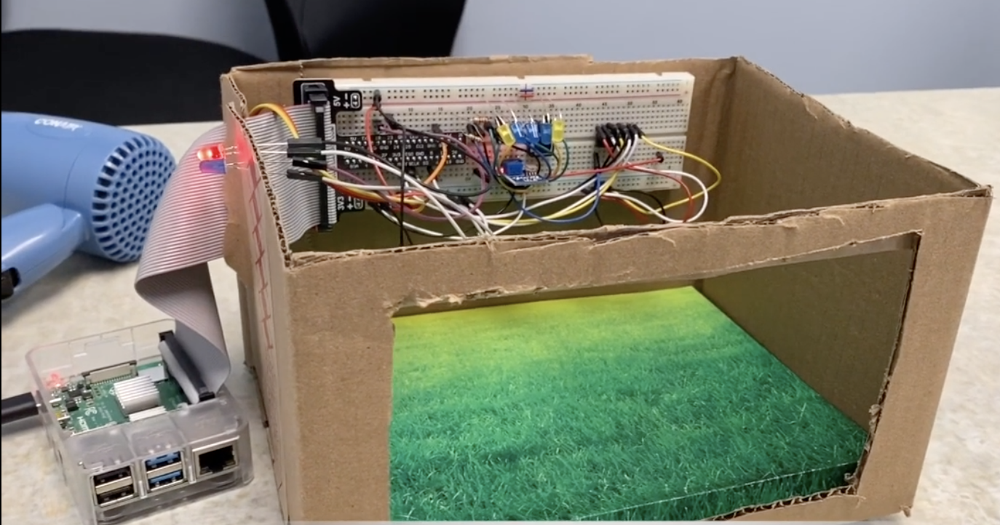

* For the temperature part, we use two LEDs (Red/ Blue) as indicators of whether the temperature is above 28°C or not. The data acquired by temperature sensor is sent to Raspberry Pi and the python script will determine if it is cold or warm. Red LED means warm and blue LED means cold.

* For the light part, we use 5 LEDs as our controller. These LEDs will help to generate extra light if the environment is not bright enough. The control method behind is PID. We collect the light intensity every iteration and based on the target value, we can calculate the error of light intensity. Then, we sum up all errors in history as the integral of error and subtract this error with last error to get the differential of error. We multiply them (error, integral, differential) with three parameters (P, I, D) to get the control variable. When we have the control variable, we adjust the duty ratio of the PWM wave to the LED, and the LEDs will respond with different intensity of light. After carefully tuning these parameters, we found the most suitable values for them, and we recorded the video with the best parameters.

## 2.4 PID controller

A proportional–integral–derivative controller (PID controller or three-term controller) is a control loop mechanism employing feedback that is widely used in industrial control systems and a variety of other applications requiring continuously modulated control. A PID controller continuously calculates an error value {\displaystyle e(t)}e(t) as the difference between a desired setpoint (SP) and a measured process variable (PV) and applies a correction based on proportional, integral, and derivative terms (denoted P, I, and D respectively), hence the name.

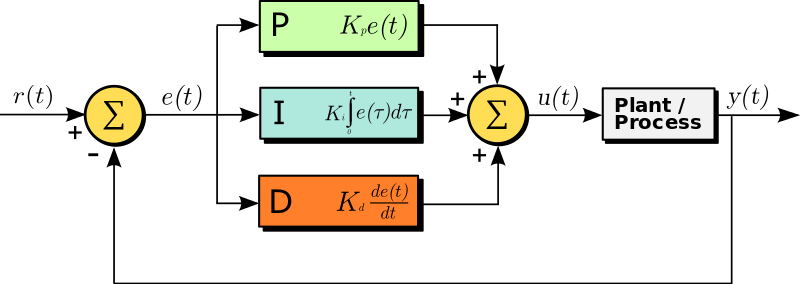

## 3. Experiments and Results

### 3.1 Temperature indicator system

For temperature indication system, the humidity and temperature sensor measures temperature every 0.1s. We use two LEDs - one is blue and the other one is red as indicators. To simplify the problem, we assume that the best temperature for the plant is 28°C.

Normally, the red LED keeps lightened. If the temperature is lower than 28°C, the red LED will turn off and the blue LED will turn on, which indicates the greenhouse needs to be warmed up. In order to maintain the environment at the required temperature, a hair dryer is used to adjust the temperature in the greenhouse. After warming up, the blue LED turns off and the red one turns on again, which represents the ideal state for the growth of the plant is restored.

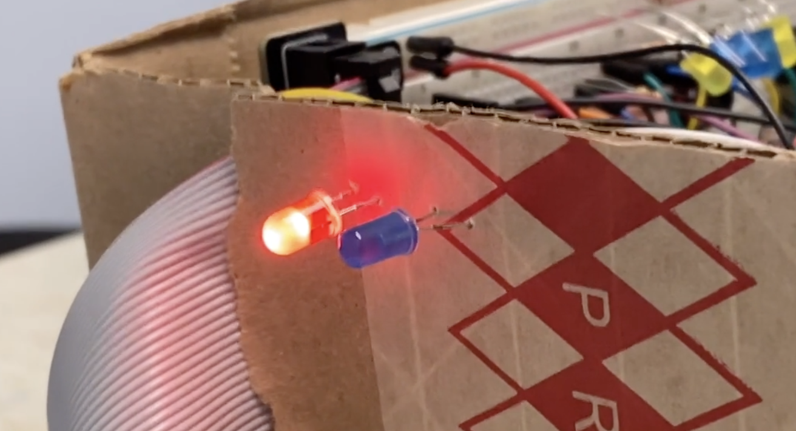

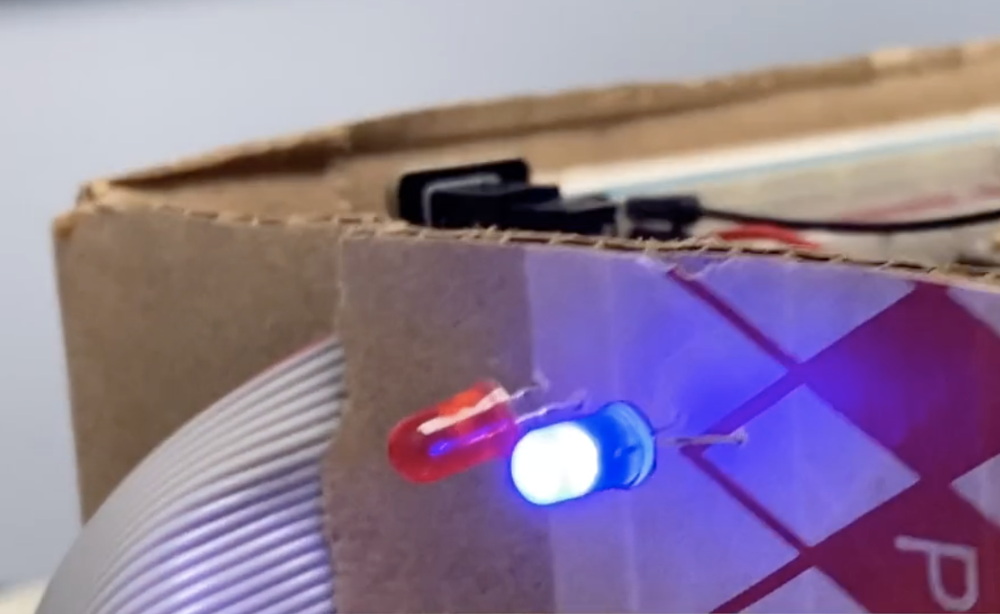

### 3.2 Light control system

For the light compensation system, the light sensor measures light intensity every 0.1s. PID is used to control LEDs to provide extra light for the greenhouse system and keep the light intensity of the greenhouse at a stable value.

On sunny days, the external light is sufficient for the greenhouse and meets its needs. Therefore, the LEDs would not turn on.

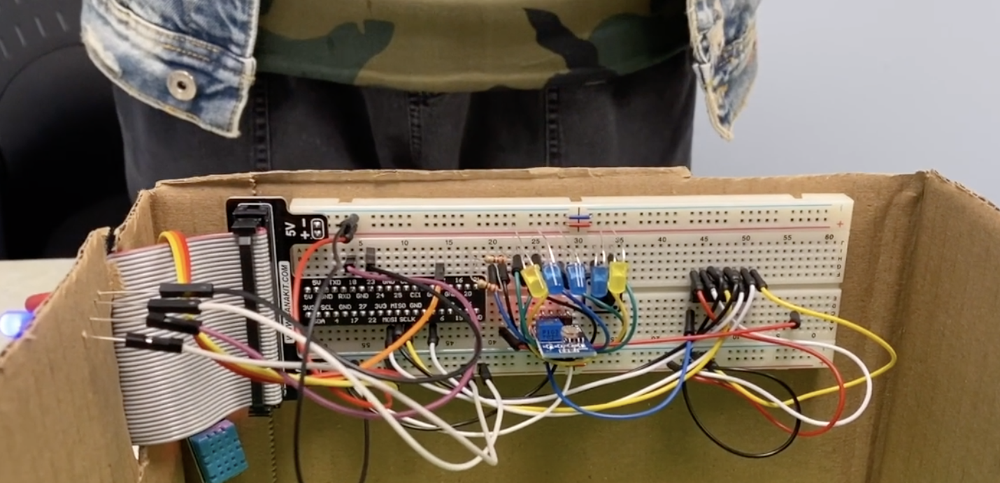

On cloudy days, the external light is weakened and cannot meet the needs of the greenhouse. Hence, the LEDs would automatically turn on and gradually turn up to make up the required light intensity.

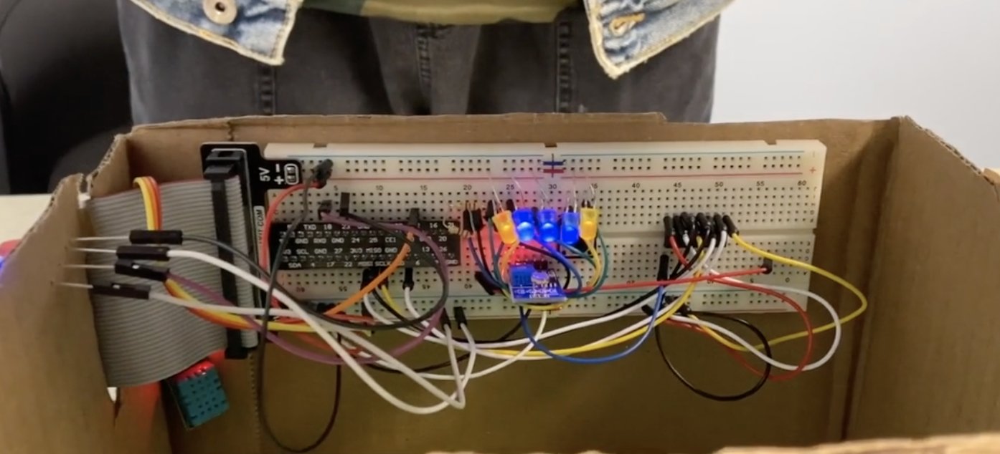

The LEDs would further enhance the brightness at night, that is, they would gradually turn up until the greenhouse has enough light intensity even though there is no external light at all. They would turn down again when the sun rises and turn off if light intensity meets the needs.

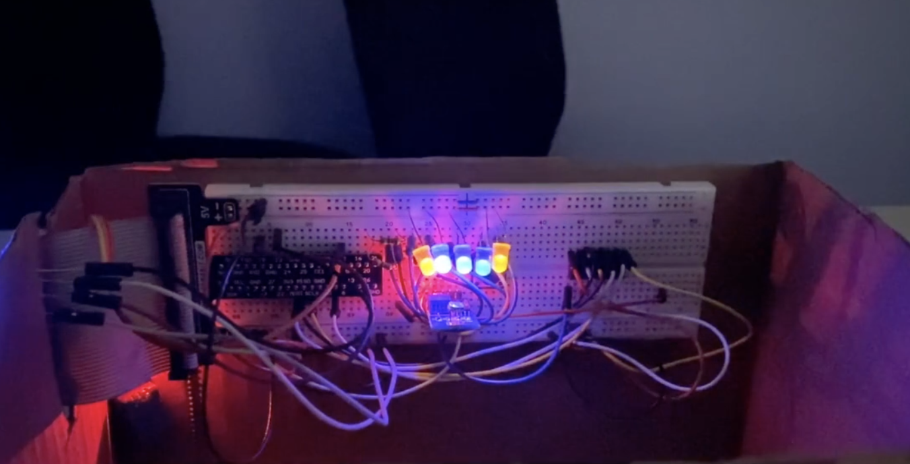

## 4. OpenChirp

We integrated our system to the OpenChirp so we can visualize the light intensity and the lightness of the LEDs. As the figure shows below:

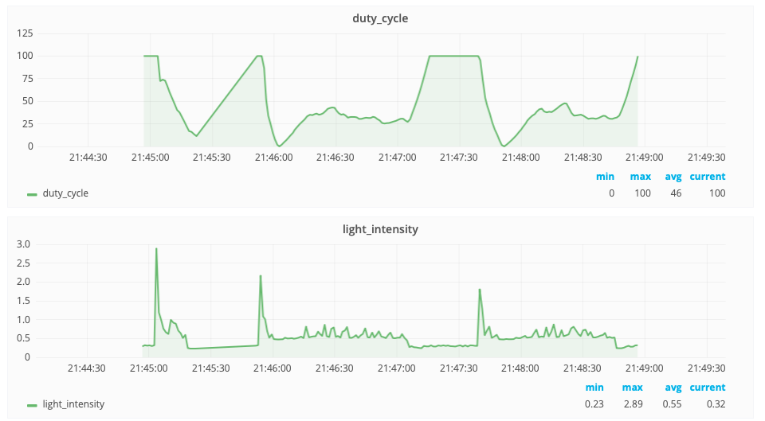

A duty cycle or power cycle is the fraction of one period in which a signal or system is active. We use the duty cycle to represent the lightness of the LEDs. When the duty cycle is 0%, it means that the LEDs are fully lighting up, while the duty cycle is 100%, the LEDs are turned off and there is no light from the bulbs. And we represent the light intensity with voltage. The higher voltage of the circuit is, the darker is the environment. So we can see that at 21:45 the voltage jumped up which means we turned off the light and the system was in darkness, at this time, the LEDs were turned on gradually to make up the loss of the light intensity. And at 21:47, we turned on the lights, so the duty cycle of the LEDs increased gradually which means the bulbs turned off because there was enough light.

## 4. Discussion

## 5. Code

[OpenChirp](openchirp_code.md)

## 6. Reference
1. [https://en.m.wikipedia.org/wiki/Greenhouse](https://en.m.wikipedia.org/wiki/Greenhouse)
2. [https://www.robotshop.com/en/dht11-temperature-humidity-sensor-module-dyn.html](https://www.robotshop.com/en/dht11-temperature-humidity-sensor-module-dyn.html)
3. [https://www.makerfabs.com/light-sensor-module.html](https://www.makerfabs.com/light-sensor-module.html)
4. [https://en.wikipedia.org/wiki/Duty_cycle](https://en.wikipedia.org/wiki/Duty_cycle)
5. [https://en.wikipedia.org/wiki/PID_controller](https://en.wikipedia.org/wiki/PID_controller)
6. [https://en.wikipedia.org/wiki/Pulse-width_modulation](https://en.wikipedia.org/wiki/Pulse-width_modulation)

