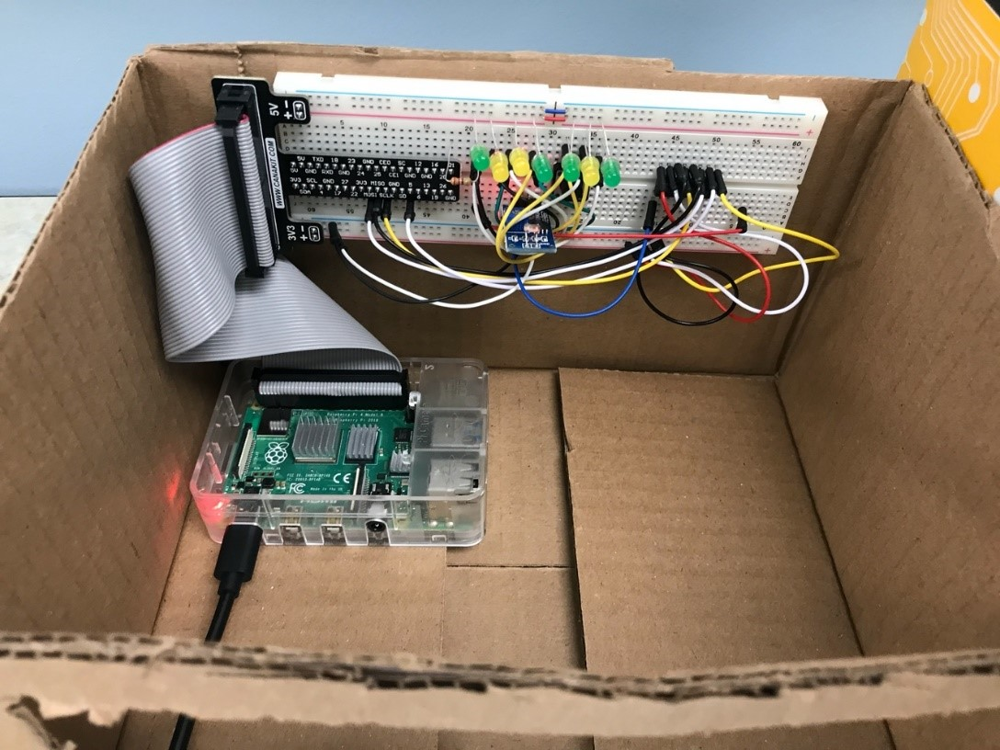

# Progress 3

## Oct 10th

## Goal:
* Measure voltage of different environment connecting with LED.

Group | Environment | Operation | LED | Voltage | Note
----- | ----------- | --------- | --- | ------- | ----
1 | Day(Strong external light) | Turn on light and no cover on the green house(Fig. 1) | Turn off LED | A | Treatment Group

## Problems:
* Light intensity of LED is too weak to provide enough light for model. Therefore, it is just used for presentation.

Fig.1:

Fig.2:
