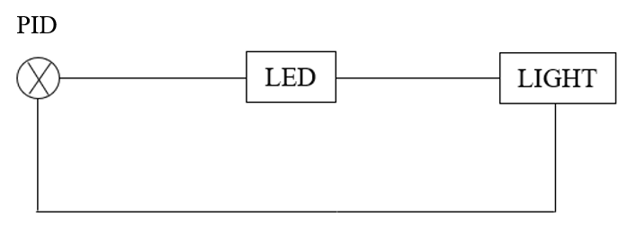

# Progress 4

## Oct 10th

Met with TA to discuss our rough idea (as picture shown below) and current progress.



## Main progress for above control system:
PID controller automatically computes previous intensity light of LED to obtain the next value of intensity light. As light intensity of external light increases gradually, light of LED decreases gradually.

## Main pseudo code for above control system:
```python
target = 2
ini = 0
pre_input = 0
pwm = 0
while True:
  pre_input = input
  error = input – target
  diff = input – pre_input
  ini += error
  control = p * error + I * ini + D * diff
  pwm += control
```


