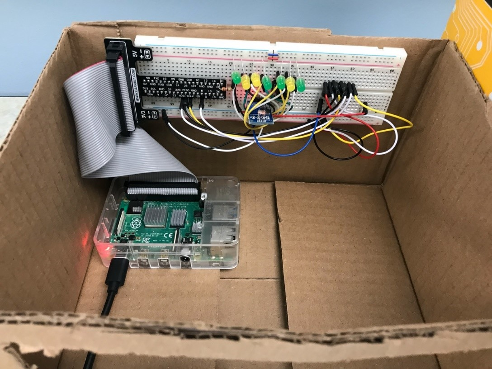
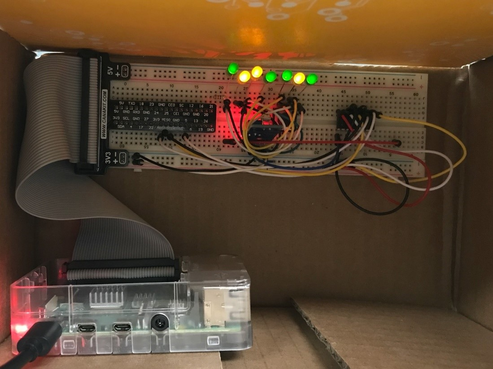

# Progress 4

## Oct 14th

## Goal:
* Measure voltage of different environment connecting with LED.
* In order to achieve control of PID controller, target value of voltage needs to be set between A and D

Group | Environment | Operation | LED | Voltage | Note
----- | ----------- | --------- | --- | ------- | ----
1 | Day (Strong external light) | Turn on light and no cover on the green house (Fig. 1) | Turn off LED | A | Treatment Group
2 | Night but turn on light (Weak external light) | Turn on light but has cover on the green house (Fig.2) | Turn off LED | B | Treatment group
3 | Night but turn on light (Weak external light) | Turn on light but has cover on the green house (Fig.2) | Turn off LED | C | Treatment group
4 | Night (No external light) | Turn off light | Turn on LED | D | Control group

## Problems:
* Light intensity of LED is too weak to provide enough light for model. Therefore, it is just used for presentation.

Fig.1

Fig.2
